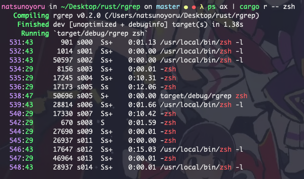

# rgrep
A demo with much more limited ability than grep. It's also one of my rust coding practices.

Effect:
- File:

- Pipe:

## Features:
- Showing the line and the position of the matched words
- Can capture the output of the pipe, like``ps aux | rgrep <keyword>``

## TODOs
- Enable range search of the file(s)
- **Reconstruct the code**, try to implement ``impl`` and Trait rather than lots of ``fn`` s
- Add these functions, and maybe some more:
    - Match multiple regexs
    - You can use use your own .conf to customize the content of the args
    - Async I/Os
    - Enable the file path as the arg
- Add more test cases
- Add benchmarks

## Special Thanks
- [imag1ne - grepr](https://github.com/imag1ne/grepr): 
The code make me get some idea about the trait and impl things, and it is with clear structure :)